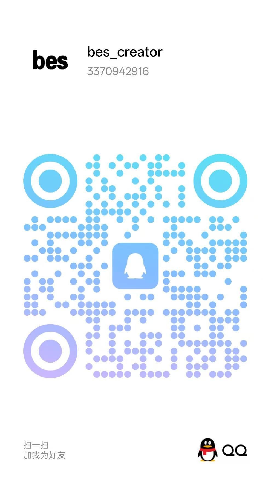
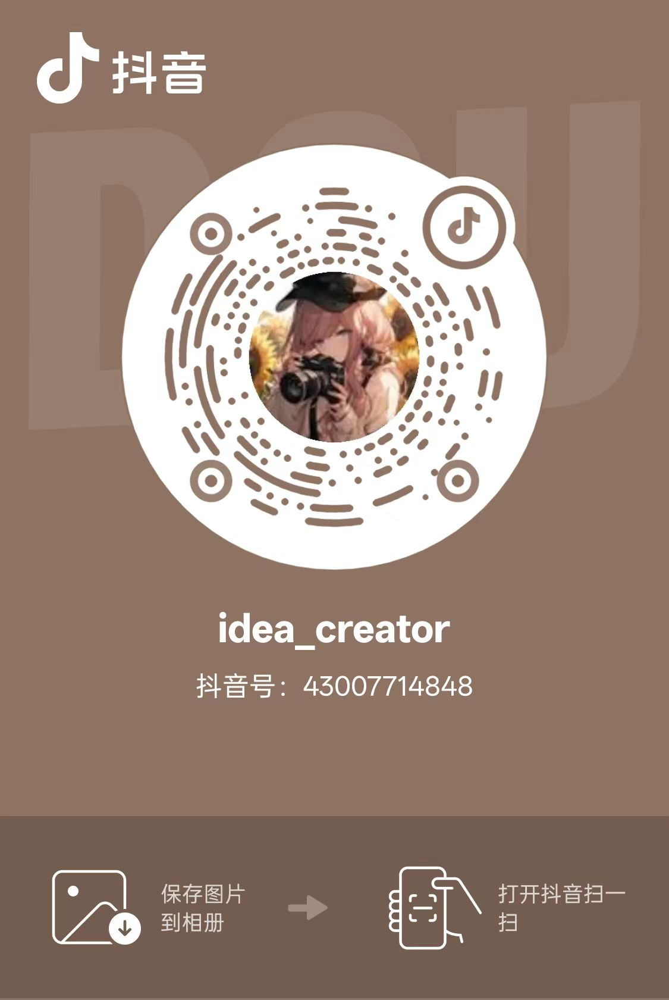
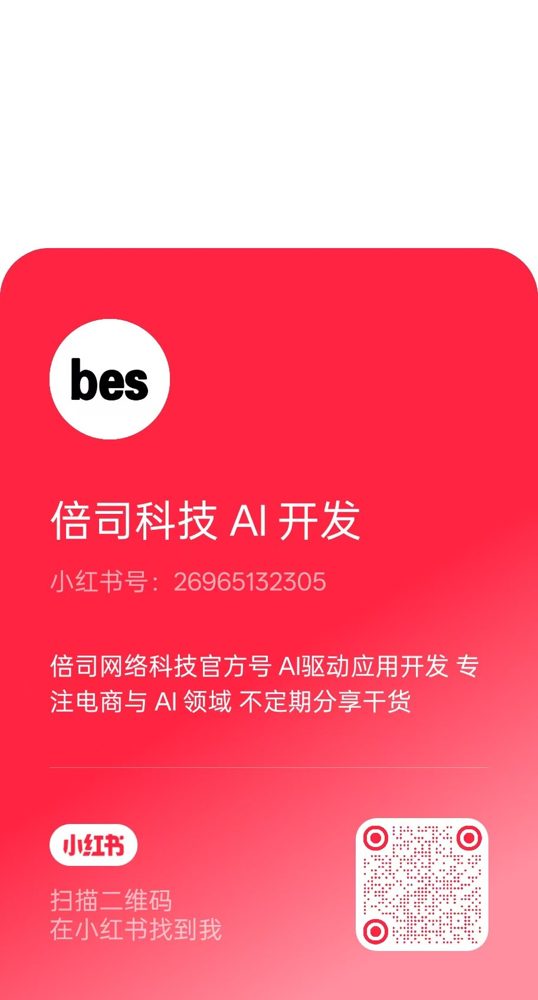
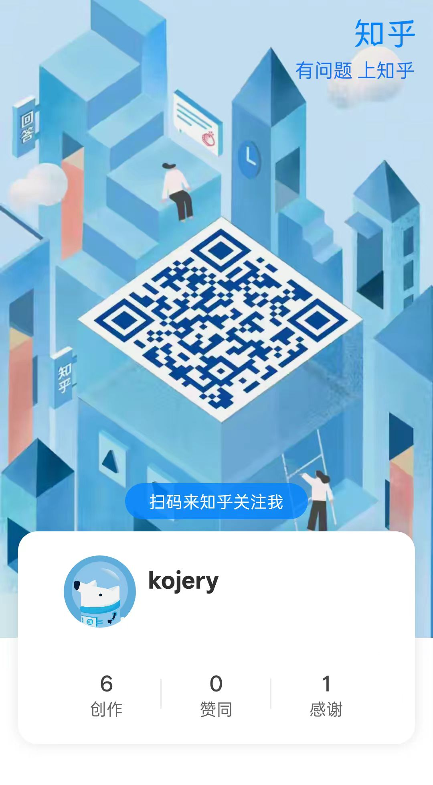
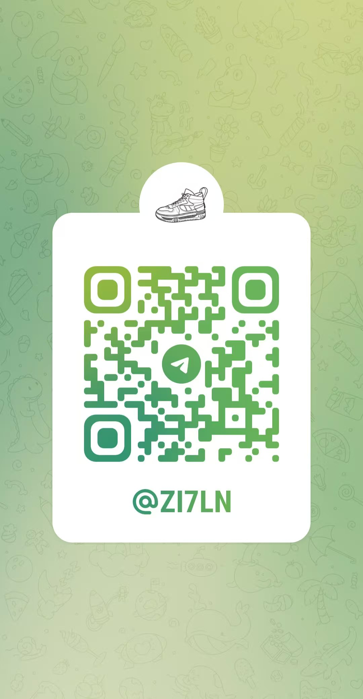
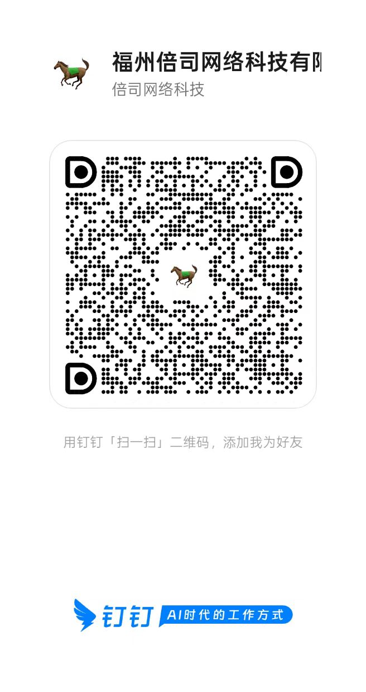
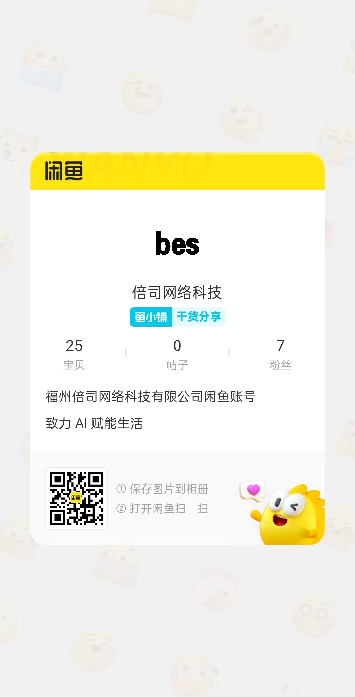

# linzhiqing.dev

欢迎来到我的个人入口页：这里可以快速联系我、了解我正在推进的项目，也欢迎你的支持与赞赏。

<section class="qr-hub" aria-label="联系与赞赏二维码">
  

    <h2 class="qr-title">联系我 / 赞赏</h2>
    
悬浮预览二维码，点击下载保存

  

  

    

      
联系方式

      

        <a class="qr-button" href="qr_code/wechat-contact.jpg" download="wechat-contact.jpg" title="微信 二维码">
          微信
          扫码添加
          下载二维码
          
        </a>
        <a class="qr-button" href="qr_code/qq-bes-creator.jpg" download="qq-bes-creator.jpg" title="QQ 二维码">
          QQ
          bes_creator / 3370942916
          下载二维码
          
        </a>
      

      

        
显示更多

        

        <a class="qr-button" href="qr_code/douyin-idea-creator.jpg" download="douyin-idea-creator.jpg" title="抖音 二维码">
          抖音
          idea_creator
          下载二维码
          
        </a>
        <a class="qr-button" href="qr_code/kuaishou-3375494733.jpg" download="kuaishou-3375494733.jpg" title="快手 二维码">
          快手
          3375494733
          下载二维码
          
        </a>
        <a class="qr-button" href="qr_code/bilibili-contact.jpg" download="bilibili-contact.jpg" title="哔哩哔哩 二维码">
          哔哩哔哩
          来碗红菇卤面
          下载二维码
          
        </a>
        <a class="qr-button" href="qr_code/xiaohongshu-26965132305.jpg" download="xiaohongshu-26965132305.jpg" title="小红书 二维码">
          小红书
          26965132305
          下载二维码
          
        </a>
        <a class="qr-button" href="qr_code/zhihu-kojery.jpg" download="zhihu-kojery.jpg" title="知乎 二维码">
          知乎
          kojery
          下载二维码
          
        </a>
        <a class="qr-button" href="qr_code/telegram-z17ln.jpg" download="telegram-z17ln.jpg" title="Telegram 二维码">
          Telegram
          @Z17LN
          下载二维码
          
        </a>
        <a class="qr-button" href="qr_code/feishu-linzhiqing.jpg" download="feishu-linzhiqing.jpg" title="飞书 二维码">
          飞书
          林智清
          下载二维码
          
        </a>
        <a class="qr-button" href="qr_code/dingtalk-besitech.jpg" download="dingtalk-besitech.jpg" title="钉钉 二维码">
          钉钉
          倍司网络科技
          下载二维码
          
        </a>
        <a class="qr-button" href="qr_code/alipay-contact-bes-creator.jpg" download="alipay-contact-bes-creator.jpg" title="支付宝好友二维码">
          支付宝好友
          bes_creator
          下载二维码
          
        </a>
        <a class="qr-button" href="qr_code/xianyu-bes.jpg" download="xianyu-bes.jpg" title="闲鱼 二维码">
          闲鱼
          bes
          下载二维码
          
        </a>
        

      

    

    

      
赞赏支持

      

        <a class="qr-button" href="qr_code/wechat-pay.jpg" download="wechat-pay.jpg" title="微信支付收款码">
          微信支付
          赞赏支持
          下载二维码
          
        </a>
        <a class="qr-button" href="qr_code/alipay-pay.jpg" download="alipay-pay.jpg" title="支付宝收款码">
          支付宝
          赞赏支持
          下载二维码
          
        </a>
      

    

  

</section>

---

## 项目

状态说明：🟡 开发中 · 🟢 维护中/更新中 · 🟠 准备中 · ✅ 已完成 · 🔴 失败项目

### 在线产品 / 网站

| 项目       | 状态      | 链接                                      |
| ---------- | --------- | ----------------------------------------- |
| Visionflow | 🟡 开发中 | [在线](https://visionflow.im)             |
| AI Box     | 🟢 维护中 | [在线](https://aibox.beisi.tech/)         |
| 应用仓库   | 🟢 维护中 | [在线](https://yyck.beisi.tech/)          |
| 小程序商城 | 🟢 维护中 | [在线](https://hioshop.beisi.tech/)       |
| 公司网站   | 🟡 开发中 | [在线](https://beisi.tech/)               |
| 企业文档   | 🟢 更新中 | [在线](https://beisi-tech.github.io/docs) |

### GitHub 项目

| 项目             | 状态        | 链接                                                   |
| ---------------- | ----------- | ------------------------------------------------------ |
| 飞书智能助手     | 🟡 开发中   | [GitHub](https://github.com/beisi-tech/feishu-copilot) |
| 亚马逊电商自动化 | 🟠 准备中   | [GitHub](https://github.com/beisi-tech/amz-auto-ai)    |
| AI 网络爬虫      | 🟠 准备中   | [GitHub](https://github.com/xiaolinbenben/graber)      |
| b2b 外贸站       | 🟢 维护中   | [GitHub](https://github.com/beisi-tech/web_b2b)        |
| 知心家教小程序   | 🔴 失败项目 | [GitHub](https://github.com/beisi-tech/zhixin-tutor)   |

### 娱乐项目

| 项目                   | 状态      | 链接                                                                                                                      |
| ---------------------- | --------- | ------------------------------------------------------------------------------------------------------------------------- |
| 早安邮件               | 🟡 开发中 | [GitHub](https://github.com/xiaolintuanzi/love-scheduler)                                                                 |
| 福州大学水电费爬虫     | ✅ 已完成 | [GitHub](https://github.com/xiaolinbenben/fzu-electricity-fee-spider)                                                     |
| 10000 中国普通人名大全 | ✅ 已完成 | [GitHub](https://github.com/xiaolinbenben/10k-chinese-names) / [在线](https://xiaolinbenben.github.io/10k-chinese-names/) |

### 指南 / 合集 / 数据

| 项目                | 状态      | 链接                                                        |
| ------------------- | --------- | ----------------------------------------------------------- |
| 提示词合集          | 🟢 更新中 | [GitHub](https://github.com/xiaolinbenben/awesome-prompts)  |
| cf-workers 使用指南 | 🟢 更新中 | [GitHub](https://github.com/xiaolinbenben/cf-workers)       |
| SiteSucker 使用指南 | 🟢 更新中 | [GitHub](https://github.com/xiaolinbenben/sitesucker-guide) |
| 全栈开发者入门练习  | ✅ 已完成 | [GitHub](https://github.com/beisi-tech/beisi-start)         |

如需纠错或更新状态，欢迎在相关仓库提交 issue。
